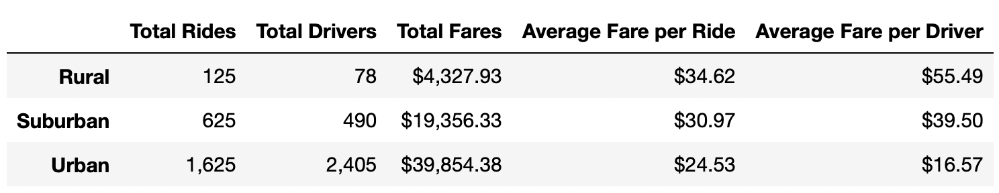
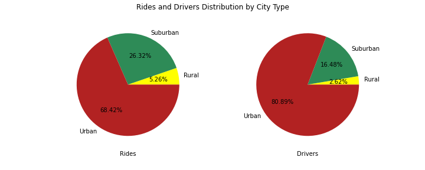
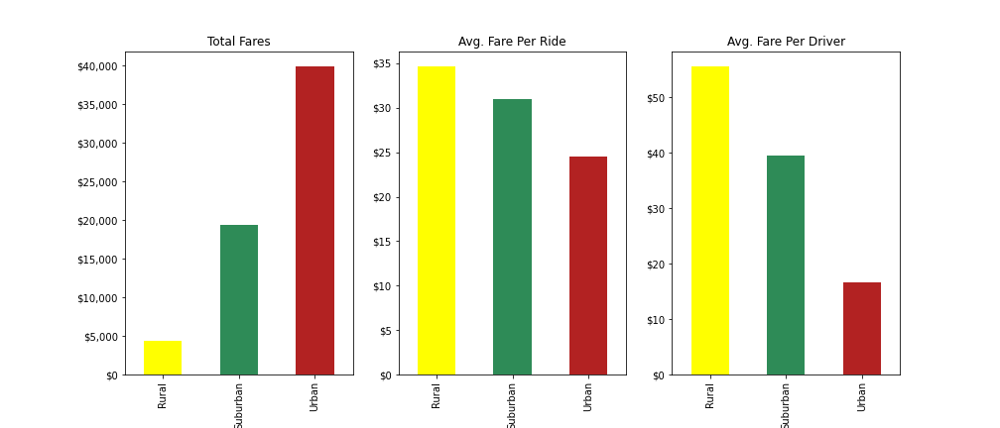
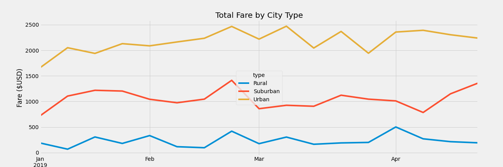

# PyBer Data Analysis

## Overview of Analysis

PyBer is a python based ride sharing app company. The company is looking to understand different relationships between factors like city type, number of drivers/riders, fares to help in improving access to rider-sharing services and determine affordability for underserved neighbourhoods. 

For this project PyBer is specifically looking to understand the relationship of weekly fares to city type. This should help in understanding how the data differs by city type and how it can help in their decision making.

## Resources
- Data Source: city_data.csv, ride_data.csv
- Software: Python 3.9.7, Jupyter Notebook

---

## Data Analysis Results

Below are some of the key observations from the data analysis:

1. Overall Summary by City Type

Below is overall summary by city type:

One immediate observation is that the total rides and drivers are very less in rural cities compared to urban cities. 

- Rides Data
    - Total Rides in urban cities - 1,625
    - Total Ries in suburban cities - 625
    - Total Rides in rural cities - 125
- Drivers Data
    - Total Drivers in urban cities - 2,405
    - Total Drivers in suburban cities - 490
    - Total Drivers in rural cities - 78

68.42% of the Rides are from urban cities while 80.89% of the drivers are in urban cities. Sururban cities take up 26.32% of the rides with 16.48% of the drivers. Finally Rural cities take up only 5.26% of the total rides with 2.62% of the drivers.

Looking at the fares observed that the total fares were much higher in urban cities, but interestingly the average fares by rides and driver were higher for rural cities. This would attribute to the longer distance and increased cost in rural cities.

- Total Fares
    - For urban cities - $39,854.38
    - For suburban cities - $19,356.33
    - For rural cities - $4,327.93
- Average Fare per Ride
    - For urban cities - $24.53
    - For suburban cities - $30.97
    - For rural cities - $34.62
- Average Fare per Driver
    - For urban cities - $16.57
    - For suburban cities - $39.50
    - For rural cities - $55.49

2. Summary by fares over a period of time.

Finally below is the overall summary comparing the total fares over the 4 months. There is a clear demarkation on fares by each type of city where urban cities has the most followed by suburban and rural cities. While mostly through the time it stays flat, for urban and suburban it starts a little lower in Jan and goes higher in April.

---

## PyBer Data Analysis Summary

With the above details below are the business recommendations for addressing disparities among different types of cities

- With 2405 drivers in urban cities only 1625 rides were taken. This shows that only 67.5% of the driver capacity is used in urban cities. To reduce this disparity the recommdation would be to go with the below 3 changes helping to ensure better availability in every type of city
    1. 10% more drivers than rides in rural cities - 138 drivers
    2. 15% more drivers than rides in suburban cities - 725 drivers
    3. 30% more drivers than rides in urban cities - reducing their driver count from 2405 to 2110
- An additional area to look at would be the staff based on time of year. In January a higher precense in rural city would be useful, while staff more in urban/suburban cities during april and the rides show a slight increasing trend.
- Collecting data on distance travelled for each of the ride will enable to dive further on average fares by distance and check for additional disparity.